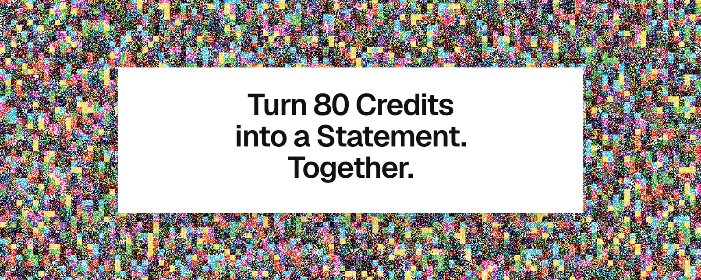
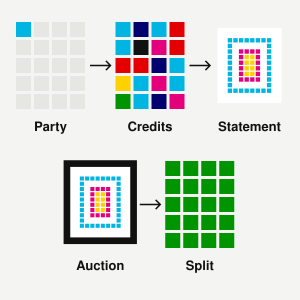
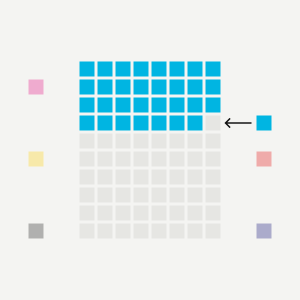
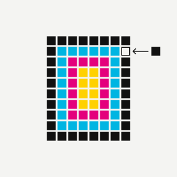
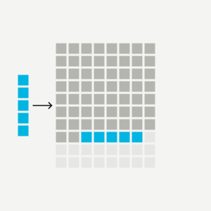
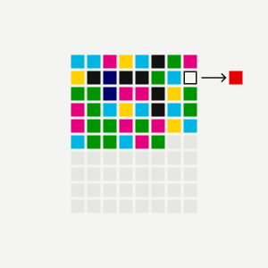
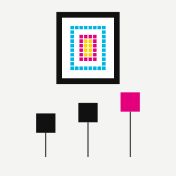

<a href="https://creditunion.fun"></a>

<p align="center"><b><a href="https://creditunion.fun">creditunion.fun</a></b> · <a href="#how-a-credit-union-works">How it works</a> · <a href="contracts/AUDIT.md">Audit</a> · <a href="contracts/ADAPTER.md">Adapter plan</a> · <a href="#deployed-addresses">Addresses</a></p>

# Credit Union

Credit Union lets holders of Jack Butcher's [Credits](https://jack.art/credits) pool 80 Credits into a Credit Union. At 80 the Credit Union burns them into one Statement, auctions it onchain, and splits the sale among everyone in. Contracts hold the Credits and the ETH: no owner, pause or upgrade. The fee recipient (a multisig) sets fees and the score table for Credit Unions opened afterwards; it can't touch an open one. Live on Sepolia testnet; mainnet is not deployed yet.

<table>
<tr><td width="33%" valign="top"><br><b>Start a Credit Union</b><br>Pool your Credits with other holders. At 80 they burn into a Statement, and everyone in shares the sale.</td><td width="33%" valign="top"><br><b>Deposit</b><br>Pick exactly which Credits get in: any Credit, or only ones with the traits you choose.</td><td width="33%" valign="top"><br><b>Layout</b><br>Arrange the 80 however you like: in deposit order, by Credit number, or painted into a design.</td></tr>
<tr><td width="33%" valign="top"><br><b>Buy in</b><br>Buy the cheapest Credits that fit from OpenSea, straight into any Credit Union.</td><td width="33%" valign="top"><br><b>Withdrawals</b><br>Withdraw anytime until a full Credit Union locks. If nobody burns it within the hour, it unlocks again.</td><td width="33%" valign="top"><br><b>Dividends</b><br>The Statement goes to auction, and the proceeds are split across its members.</td></tr>
</table>

## How a Credit Union works

1. **Open.** Anyone with a Credit opens a Credit Union and sets its rules: who can join, the burn order, and the split (Equal or Early bird).
2. **Join.** Holders deposit Credits. Every deposit is checked onchain against the Credit Union's rules. No Credit? The Sweeper buys the cheapest fitting OpenSea listings and deposits them in one transaction.
3. **Leave.** Anyone can withdraw until the Credit Union locks. A full Credit Union never locks before Jack's contract and the burn adapter are live. Once they are, a full Credit Union counts down 5 minutes (leaving drops it to 79 and stops the clock), then locks for 1 hour, during which nobody can leave and anyone can burn. If nobody burns it, it unlocks: depositors can leave again, and anyone can call `restartCountdown()` for a fresh 5 minutes and hour.
4. **Burn.** During the locked hour, anyone calls `assemble()`. The 80 Credits go to Jack's contract in the Credit Union's order and the Credit Union must end up holding the Statement, or the call reverts.
5. **Auction.** 24 hours from the first bid. Each bid beats the last by 5% (minimum 0.01 ETH). Bids in the last 15 minutes extend it by 15 minutes. Outbid ETH is refunded in the same transaction. The site opens Credit Unions with no reserve.
6. **Split.** Anyone settles. The Statement goes to the winner. A 2% protocol fee comes off the top, only if it sells. The rest goes to the 80 positions: 1/80 each (Equal), or a straight line from 1.5 shares for the first deposit to 0.5 for the last (Early bird). Payouts are pulled with `claim`, callable by anyone for anyone.

**Who can join.** Any combination of Jack's traits (Colors, Eights, Print, Weight, Plates, Bits), payment time, [rating](https://jack.art/credits/rating), a Credit-number range, or a named list of up to 200 Credits.

**Burn order.** Deposit order, mint time, Credit number, the creator's order, or a painted sheet (the 8×10 grid painted by palette; each painted slot only takes a matching Credit).

## For developers

<details>
<summary><b>Repo layout</b></summary>

```
contracts/          Foundry
  src/              Batch, BatchFactory, Sweeper, Ratings, interfaces, mocks, vendored Credits art
  script/           deploy and check scripts
  test/             unit, fuzz, invariant, adversarial and mainnet fork tests
  data/scores.bin   the frozen rating table deployed onchain
  AUDIT.md          internal review log
  ADAPTER.md        the plan for connecting Jack's Statement contract
  ORDER.md          how each Credit Union decides where every Credit goes on the sheet
  DEPLOY.md         the mainnet deployment record: addresses, settings, commit
  SAFE.md           what the fee recipient multisig can and can't do
web/                Cloudflare Worker + static site (Vite, TypeScript, viem, no framework)
  src/app/          the site; reads the chain directly, wallets sign in the browser (EIP-6963)
  src/worker/       the Worker: config, RPC proxy, art, ratings, OpenSea, link cards
  src/shared/       code used by both (rating formula, eligibility rules, layout)
  scripts/          data and asset builders
  public/           static assets and precomputed edition data
  data/             credits.json.gz, the full edition every derived file is built from
```

There is no database or indexer. Credit Unions, slots and bids are read from the contracts.

</details>

<details>
<summary><b>Contracts</b></summary>

| Contract | What it does |
|---|---|
| `BatchFactory` | Deploys Credit Unions as minimal clones, moves Credits from its caller into its own Credit Unions, holds fees and the one-time assembler setting. |
| `Batch` | One Credit Union: eligibility checks, deposits and withdrawals, lock, burn through the assembler, auction, split, claims. |
| `Sweeper` | Buys OpenSea listings through Seaport 1.6 and deposits them in the buyer's name. Unused ETH is refunded; listings that sold first are skipped. 2% fee. |
| `Ratings` | Jack's rating for all 122,154 Credits under one methodology version (`version()`), stored as data contracts and read by eligibility rules. Anyone can call `scoreOf`. The factory can move new Credit Unions to a later version; each Credit Union keeps the table it opened with, and `ratingsHistory()` lists every table used. |
| `IAssembler` | The adapter a Credit Union calls (never delegatecalls) to burn 80 Credits into a Statement. `MockAssembler` is the testnet version; the mainnet adapter gets written once Jack's Statement contract is published. |

The factory can deploy with no assembler. Credit Unions fill but never lock, so anyone can always leave. When the adapter is ready, the setter address proposes it once; 30 minutes later anyone activates it and the setter has no further powers. Only then do full Credit Unions start their 5-minute countdowns.

Fees are set at deploy and capped in code: protocol 2% (max 5%), creator 0% (max 10%), sweep 2% (max 5%). The fee recipient can change them within the caps; a Credit Union keeps the fees it opened with.

Review history, findings and fixes: [contracts/AUDIT.md](contracts/AUDIT.md).

How burning gets switched on once Jack's Statement contract ships, who controls it, and how it's tested: [contracts/ADAPTER.md](contracts/ADAPTER.md).

How the 80 are ordered, and how a Layout paints the sheet by trait: [contracts/ORDER.md](contracts/ORDER.md).

#### Build and test

```sh
git submodule update --init --recursive
cd contracts
forge build
forge test
```

The fork tests (`*.fork.t.sol`) run against mainnet Seaport and Credits through a public node. Set `MAINNET_RPC` to use your own.

#### Deploy

Copy `contracts/.env.example` to `contracts/.env`, fill it in, and load it with `set -a; . ./.env; set +a`.

| Script | Purpose | Env |
|---|---|---|
| `DeployTestnet.s.sol` | Sepolia: test Credits (real art, anyone can mint), mock Statement, mock assembler, rating table, factory, Sweeper | `FEE_RECIPIENT` (optional), `STAGED` (optional, no assembler at deploy) |
| `DeployFactory.s.sol` | Sepolia: a new factory over existing test Credits and Ratings, staged like mainnet | `CREDITS`, `RATINGS`, `SETTER` and `FEE_RECIPIENT` (optional) |
| `DeployMainnet.s.sol` | Mainnet: rating table, factory, Sweeper | `FEE_RECIPIENT` (required), `SETTER`, `ASSEMBLER`, `RATINGS`, `PROTOCOL_FEE_BPS`, `CREATOR_FEE_BPS`, `SWEEP_FEE_BPS` |
| `DeployRatings.s.sol` | The rating table on its own | none |
| `CheckRatings.s.sol` | Read-only: the deployed table matches `data/scores.bin` byte for byte | args `$RATINGS $CREDITS` |
| `SeedDemo.s.sol` | Local anvil: mocks plus Credit Unions in every state | none (anvil default keys) |
| `Matrix.s.sol` | Local anvil: the end-to-end test matrix (every filter, combinations, arrangements, painted layouts per trait) | run by `web/scripts/e2e-matrix.mjs` |

```sh
forge script script/DeployTestnet.s.sol --rpc-url "$SEPOLIA_RPC" --private-key "$PRIVATE_KEY" --broadcast --slow
forge script script/DeployMainnet.s.sol --rpc-url "$MAINNET_RPC" --private-key "$PRIVATE_KEY" --broadcast --slow
forge script script/CheckRatings.s.sol --sig "run(address,address)" $RATINGS $CREDITS --rpc-url "$MAINNET_RPC"
```

Local chain for UI work:

```sh
anvil --gas-limit 60000000
bash script/seed-local.sh   # parties in every state; advances anvil's clock through the lock phases
```

</details>

<details>
<summary><b>Web</b></summary>

```sh
cd web
pnpm install
cp .dev.vars.example .dev.vars   # optional locally; RPC falls back to a public node
pnpm dev
```

Public config (`CHAIN_ID`, `CREDITS`, `FACTORY`, `SWEEPER`, `RATINGS`, `FALLBACK_RPC`) lives in `wrangler.jsonc` `vars`. To point the site at a local anvil, override them in `.dev.vars`.

After changing contracts, run `forge build` and then `pnpm abi` to regenerate `src/app/abi.ts`. `pnpm build` fails if the ABI is stale.

Worker endpoints:

| Path | |
|---|---|
| `/config.json` | chain and contract addresses for the app |
| `/rpc` | read-only JSON-RPC proxy with a method allowlist, so the RPC key stays server-side |
| `/art/:id.svg` | Credit art, rendered from the contract and cached |
| `/ratings`, `/edition/match` | ratings for ids; how many Credits in the edition fit a rule set |
| `/opensea/listings`, `/opensea/quote` | fitting listings and signed Seaport orders for the Sweeper |
| `/bids/:party`, `/owner/:id`, `/ens/:address` | bid history, current holder of a Credit, ENS name and avatar |
| `/og/...` | link-preview cards |

Rate limits are per IP (`unsafe.bindings` in `wrangler.jsonc`).

End-to-end matrix: deploys a fresh anvil (port 8546) with `contracts/script/Matrix.s.sol`, runs a second copy of the site on port 5191, and drives it in Chrome with a mock wallet. Every Credit Union's picker is checked against `Batch.canTake`, every offered Credit must deposit and every folded one revert, then Select all, Deposit and a partial Withdraw go through the page; the create page runs a few configs too. Needs foundry and Chrome.

```sh
cd web
node scripts/e2e-matrix.mjs                 # all parties + create page, prints a results table
ONLY='^L nearly' node scripts/e2e-matrix.mjs   # a subset; also HEADED=1, KEEP=1, SKIP_CREATE=1 (see the script header)
```

#### Deploy

```sh
cd web
pnpm wrangler secret put RPC_URL
pnpm wrangler secret put OPENSEA_API_KEY   # without it buy-in is hidden
pnpm wrangler secret put ENS_RPC           # optional; mainnet RPC for ENS when not on mainnet
pnpm run deploy                            # abi check, typecheck, vite build, wrangler deploy
```

Use `pnpm run deploy`, not `pnpm deploy` (that is a built-in pnpm command). Edit the `routes` in `wrangler.jsonc` to deploy under your own domain.

#### Edition data

Trait bits, the mint timeline, rating statistics and the onchain score table all derive from `web/data/credits.json.gz` (`{ id: [seed, paidAt] }` for all 122,154 Credits), rebuilt from the Credits contract's `Distributed` events:

```sh
cd web
MAINNET_RPC=... node scripts/fetch-credits.ts data/credits.json
gzip -k data/credits.json
node scripts/edition.ts data/credits.json.gz   # public/*.bin, minutes.json, ../contracts/data/scores.bin
node scripts/wall.ts                           # public/wall.bin, bits.bin, times.bin
```

Ratings follow Jack's published formula (methodology v3.4.0), reproduced in `web/src/shared/credits.ts` and checked against his API.

</details>

## Deployed addresses

**Sepolia testnet** (chain 11155111):

| | |
|---|---|
| BatchFactory | [`0xA18298a11484458344Ce41DE96C99B43dB8F21a3`](https://sepolia.etherscan.io/address/0xA18298a11484458344Ce41DE96C99B43dB8F21a3) |
| Ratings | [`0x8EfBe9Ae0b08E78Df2CB475ef1053268375ccFa7`](https://sepolia.etherscan.io/address/0x8EfBe9Ae0b08E78Df2CB475ef1053268375ccFa7) |
| Test Credits | [`0xcd24833Ddf226C13a9B3944cAC984abd33865Cd3`](https://sepolia.etherscan.io/address/0xcd24833Ddf226C13a9B3944cAC984abd33865Cd3) |
| Sweeper | not configured (OpenSea can't list test Credits) |

**Mainnet:** TBD. Credits is [`0x97630aA70AB14ed9883B41dAfccBc11349723043`](https://etherscan.io/address/0x97630aA70AB14ed9883B41dAfccBc11349723043).

## Security

The contracts have been reviewed internally (static analysis, adversarial reviews, invariant fuzzing, mainnet fork tests; see [contracts/AUDIT.md](contracts/AUDIT.md)). They have not had a third-Credit Union audit.

To report a vulnerability, open a private [GitHub security advisory](../../security/advisories/new) on this repo. Please don't open a public issue.

## Credits

Created by [@taylor_](https://x.com/taylor_) and [@bigvibessss](https://x.com/bigvibessss). MIT licensed, see [LICENSE](LICENSE).

Credit Union is independent and unofficial. It is not affiliated with or endorsed by Jack Butcher. `contracts/src/vendor/credits/` holds Jack's MIT-licensed Credits art contracts, copied unmodified (see its NOTICE.md).
